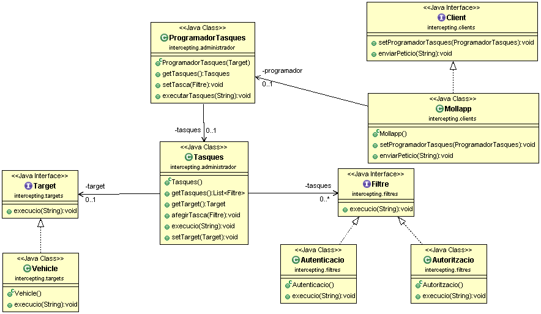

# Mollapp: App for carsharing

A new start-up that promotes electric car sharing has begun operating in Palma.

Once a user signs up to the system, the company provides a mobile app called _mollapp_ that allows access to the cars that the company and users park at various locations in Palma.

When a person wants to use one of the vehicles, the mobile application sends a request to the system, which asks for authentication with the user's name, and the system authorises access to the car. The system then sends the wireless signal to the vehicle to open the vehicle door.

Build the architecture of the system in such a way that the mobile _app_ requests the two specified checks to the system, that these are executed by the system and that the system sends the signal to open the vehicle door, taking into account that:

- The order of execution of the tasks is defined when the system is configured.
- As the start-up system is in a testing period, all users are allowed access and the authentication and authorisation logic does not have to be programmed.
- The message to the vehicle, in the above case, will be only a text message via the console.

Since this is a start-up, the product is still under development, which is why, in a matter of weeks, new tasks will be implemented in the system and will be required of the mobile _app_. Furthermore, the intention is to connect the system to other client applications. It also wants to extend the business to bicycles and scooters. You design your solution in such a way that adding new tasks, new client _apps_ and/or new vehicles is possible without changing the system structure and code.

The main script must produce the following console output:

```bash
Autenticación OK para Francesc
Autorización OK para Francesc
Puerta abierta Francesc!
```

## UML Class Diagram

Build the application according to the architecture depicted in the UML class diagram in the figure provided. At the end of the exam you will have to add new components to the diagram. Put your name on it and return it to me at the end of the exam.

Respect the names of all components, methods and properties given.



## Prepare the project

1. Create a new repo in your Github account.
2. Create a new directory on your computer and clone the Github repository.
3. Open VSCode /Eclipse /Netbeans and set as workspace the directory you cloned.
4. Create a Maven project.
5. Put the project in Git tracking and set `.gitignore`.
6. Copy and paste the main `App.java` function. Use it as a guide in the TDD process. You can't modify its code, but you can comment out the parts you haven't implemented yet.
7. Complete the classes listed here by implementing the test cases you need. Practice TDD.
8. Perform _commits_ at least every time you finish a user story.

## User stories
User stories are enunciated in the main `App.java` script.

Use this script to guide the development of the UML class diagram.

The output of this script is as follows:

```bash
Authentication OK for Francesc
Authorisation OK for Francesc
Open door Francesc!
```

### SOLID

Ensure that your solution satisfies the 5 SOLID principles:

1. Classes and methods should only have one reason to change.
2. Adding new components to the system should not require rewriting the code.
3. Use polymorphism so that each object shows its behaviour at runtime.
4. Invert dependencies to decouple code from low-level details and other components.

